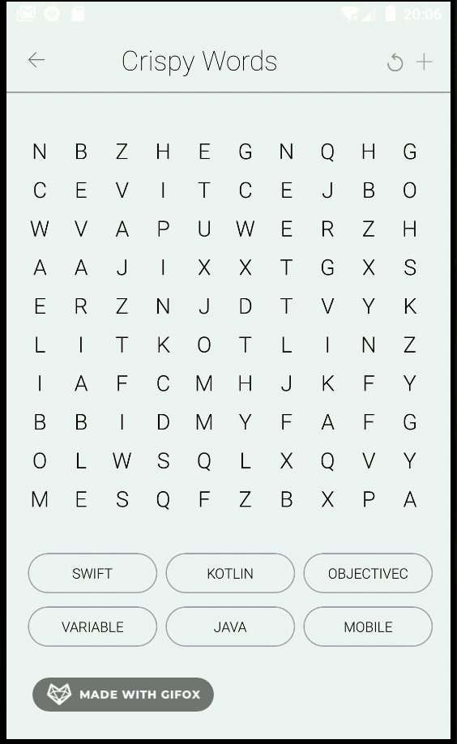

# wordChoserGame on Android

This is a word choser game on 10x10 grid. It has default 6 words: SWIFT, KOTLIN, OBJECTIVEC, VARIABLE, JAVA, MOBILE.

Features:
- It has dynamic feature for adding new words to search list once clicked on "+" plusButton.
- Once user finds the word, it gets striked out from search list.
- It has refresh feature, so words get randomized.
- User can swipe over the words to select desired word. While swiping the word background is red. 
If the word is correct, its background changes to green color.
- Swiping is allowed in all 8 directions: right to left, left to right, vertical down/up, diagonal down right/left, diagonal up right/left

Architecture:
- MVVM was chosen as architectural pattern. This pattern helps us seperate ui logic from backend logic. 
- As dependency injection Dagger 2 was chosen, because it is more reliable in the market if the project is big.
The reason of chose is that I am planning to extend the game and upload it to PlayMarket.
- One-activity-based-app is done following Google's best practice. And smooth navigation between fragments is made.
- Following DRY principle, I made custom views to avoid duplicated views.

P.S. Screenshots of three states(no/some/all words found) are attached to repository. Thanks.

Dinara Garifollina

